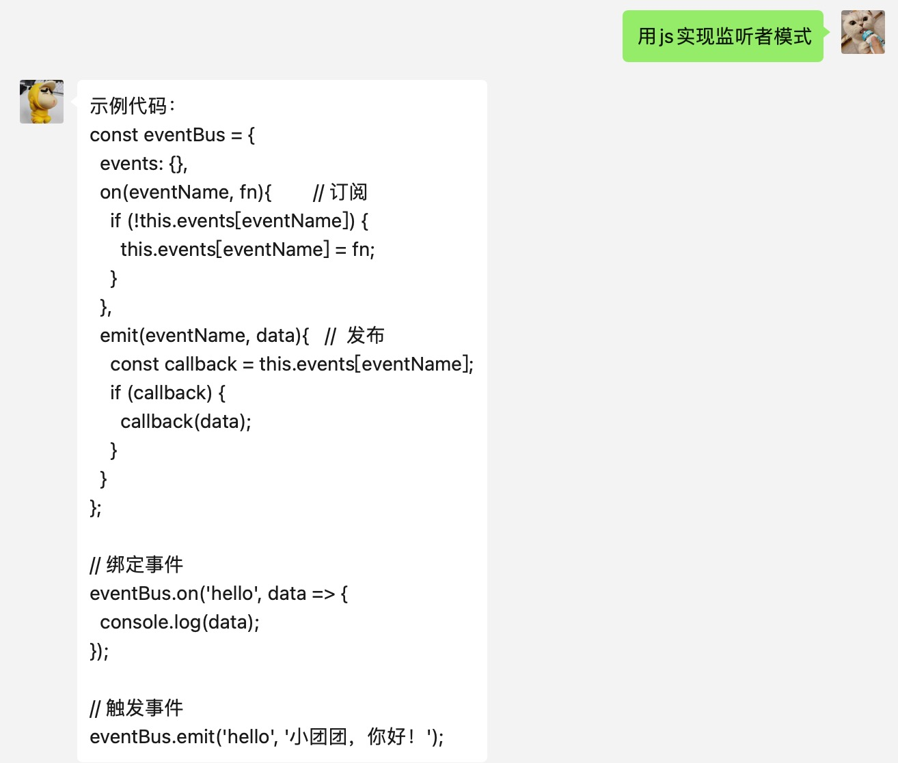
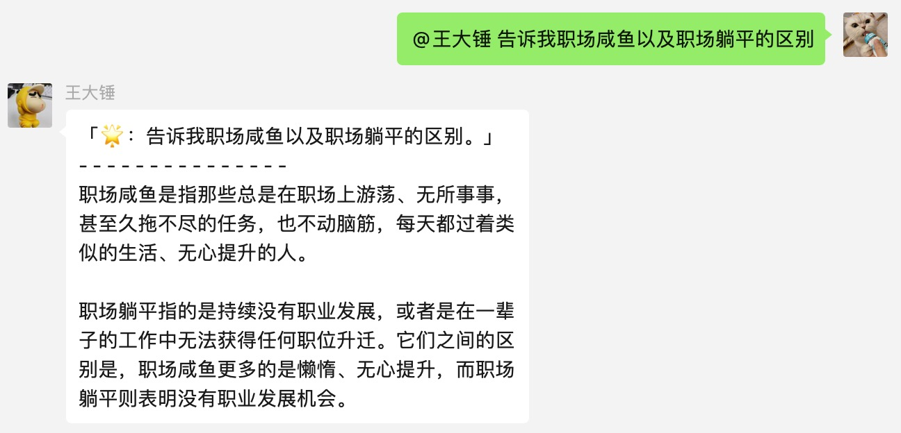

# 简介
基于ChatGPT的微信聊天机器人，通过 [OpenAI](https://www.npmjs.com/package/openai) 接口生成对话内容，使用 [Wechaty](http://wechaty.js.org/) 实现微信消息的接收和自动回复。已实现的特性如下：

- [x] **文本对话：** 接收私聊及群组中的微信消息，使用ChatGPT生成回复内容，完成自动回复
- [x] **生成图片：** 接收私聊及群组中的微信消息，使用ChatGPT生成图片自动回复，消息格式需要增加前缀：'图片xxxxxxxxxx'

## 使用效果
### 个人聊天



### 群组聊天




# 快速开始

## 准备

### 1. OpenAI账号注册

1) 前往 [OpenAI注册页面](https://beta.openai.com/signup) 创建账号，参考这篇 [教程](https://www.cnblogs.com/damugua/p/16969508.html) 可以通过虚拟手机号来接收验证码

2) 创建完账号则前往 [API管理页面](https://beta.openai.com/account/api-keys) 创建一个 API Key 并保存下来，后面需要在项目中配置这个key。

3) 另外配置文件中需要用到 Organization ID，需要在[ Organization settings ](https://platform.openai.com/account/org-settings)中获取；

> 项目中使用的对话模型是 davinci，计费方式是每1k字 (包含请求和回复) 消耗 $0.02，图片生成是每张消耗 $0.016，账号创建有免费的 $18 额度，使用完可以更换邮箱重新注册。

### 2.运行环境

支持 Linux、MacOS、Windows 系统（可在Linux服务器上长期运行)，需安装 `Node.js`。 
> Node版本 > 18。


1.拉代码：

```bash
git clone https://github.com/huangjiexin/ChatGPT-on-WeChat.git
cd chatgpt-on-wechat/
```

2.安装依赖：
```bash
npm install
```
> 如果没有node环境，请自行安装

3.修改配置文件：
配置文件在根目录的`config.yaml`中，需要复制模板文件`config.yaml.example`并修改文件名以及对应的key。
```
openaiApiKey: "sk-5dY******************************"
openaiOrganizationID: "org-bQZH********************"
chatgptTriggerKeyword: "" # 触发机器人的关键词，目前不需要配置
```

## 运行

**本地运行**，直接在项目根目录下执行：

```bash
npm run dev
```
终端输出二维码后，使用微信进行扫码，当输出 `✅ Chatbot starts success, ready to handle message!` 时表示自动回复程序已经成功运行了。
> 注意：用于登录的微信需要在支付处已完成实名认证。
>
> 另外以上如果无法注册或者无法登陆，需要自主代理到美国等节点使用该服务。

